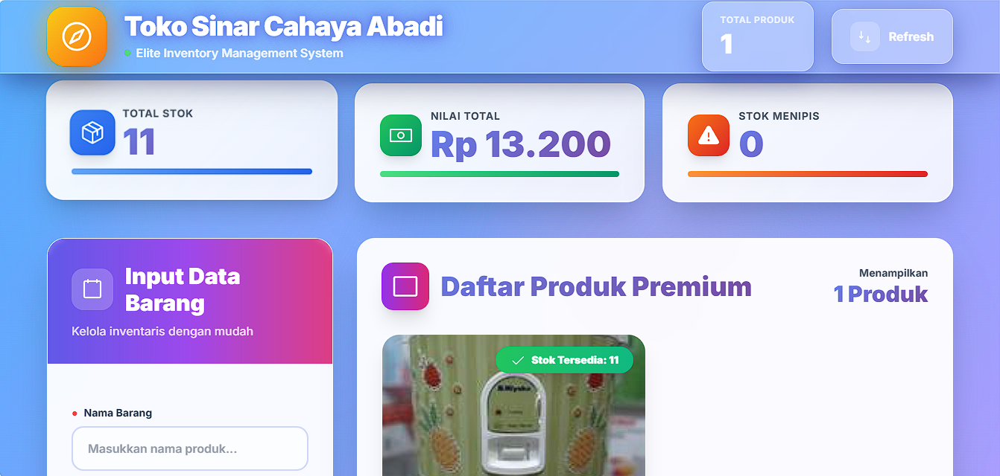

# 🌟 Elite Inventory Management System

[](https://golang.org)
[](https://www.mysql.com/)
[](LICENSE)

> **Sistem Manajemen Inventaris Modern dengan UI Premium untuk Toko Sinar Cahaya Abadi**

Aplikasi CRUD (Create, Read, Update, Delete) full-stack yang dibangun dengan **Go (Golang)** untuk backend dan **Vanilla JavaScript** dengan **Tailwind CSS** untuk frontend. Sistem ini dirancang khusus untuk mengelola inventaris produk dengan antarmuka yang sangat profesional dan elegan.



---

## ✨ Fitur Utama

### 🎨 **Frontend Premium**

- ✅ **Animated Gradient Background** - Background dinamis yang bergerak
- ✅ **Glass Morphism Design** - Efek kaca modern dengan backdrop blur
- ✅ **Real-time Statistics Dashboard** - Kartu statistik yang update otomatis
- ✅ **Responsive Layout** - Tampilan optimal di semua perangkat
- ✅ **Smooth Animations** - Animasi halus pada setiap interaksi
- ✅ **Image Upload & Preview** - Upload foto produk dengan preview
- ✅ **Badge Stok Dinamis** - Indikator visual status stok (Tersedia/Menipis/Habis)
- ✅ **SweetAlert2 Integration** - Notifikasi interaktif yang elegan
- ✅ **Skeleton Loading** - Loading state yang profesional

### 🚀 **Backend Powerful**

- ✅ **RESTful API** dengan Go
- ✅ **MySQL Database** untuk penyimpanan data
- ✅ **File Upload Management** - Sistem upload gambar otomatis
- ✅ **CORS Enabled** - Mendukung cross-origin requests
- ✅ **Error Handling** yang comprehensive
- ✅ **Logging System** untuk debugging
- ✅ **Auto Image Cleanup** - Hapus gambar lama saat update/delete

### 📊 **Fitur Manajemen**

- ✅ Tambah produk baru dengan foto
- ✅ Edit data produk existing
- ✅ Hapus produk dengan konfirmasi
- ✅ Lihat daftar semua produk
- ✅ Tracking total stok dan nilai inventaris
- ✅ Alert stok menipis otomatis
- ✅ Format harga rupiah otomatis

---

## 🛠️ Teknologi yang Digunakan

### Backend

- **Go (Golang)** - Programming language
- **MySQL** - Database management
- **go-sql-driver/mysql** - MySQL driver untuk Go

### Frontend

- **HTML5** - Struktur halaman
- **Tailwind CSS** - Styling framework
- **Vanilla JavaScript** - Logika frontend
- **SweetAlert2** - Alert & notification library
- **Animate.css** - Animation library
- **Google Fonts (Inter)** - Typography

---

## 📋 Prerequisites

Sebelum menjalankan aplikasi, pastikan Anda telah menginstall:

- [Go](https://golang.org/dl/) (version 1.21 atau lebih baru)
- [MySQL](https://dev.mysql.com/downloads/) (version 8.0 atau lebih baru)
- Web Browser modern (Chrome, Firefox, Edge, Safari)

---

## 🚀 Instalasi & Setup

### 1️⃣ Clone Repository

```bash
git clone https://github.com/username/sistem-informasi-iventaris-barang.git
cd sistem-informasi-iventaris-barang
```

### 2️⃣ Setup Database

Buat database MySQL dan tabel yang diperlukan:

```sql
CREATE DATABASE go_crud_db
    DEFAULT CHARACTER SET = 'utf8mb4';

    use go_crud_db;
    CREATE TABLE products (
    id INT AUTO_INCREMENT PRIMARY KEY,
    name VARCHAR(255) NOT NULL,
    description TEXT,
    price DECIMAL(10, 2) NOT NULL,
    created_at TIMESTAMP DEFAULT CURRENT_TIMESTAMP
);
ALTER TABLE products ADD COLUMN image_filename VARCHAR(255) NULL;

ALTER TABLE products ADD COLUMN stock INT UNSIGNED NOT NULL DEFAULT 0;
```

### 3️⃣ Install Dependencies

```bash
go mod init elite-inventory-system
go get -u github.com/go-sql-driver/mysql
```

### 4️⃣ Konfigurasi Database

Edit file `main.go` pada bagian DSN (Data Source Name) sesuai dengan konfigurasi MySQL Anda:

```go
dsn := "username:password@tcp(127.0.0.1:3306)/go_crud_db?parseTime=true"
```

Ganti:

- `username` dengan username MySQL Anda
- `password` dengan password MySQL Anda (kosongkan jika tidak ada password)

### 5️⃣ Jalankan Aplikasi

```bash
go run main.go
```

Server akan berjalan di `http://localhost:8080`

### 6️⃣ Akses Aplikasi

Buka browser dan akses:

```
http://localhost:8080
```

---

## 📁 Struktur Project

```
elite-inventory-system/
├── main.go                 # Backend Go server
├── index.html              # Frontend UI
├── uploads/                # Folder untuk menyimpan gambar (auto-created)
├── README.md              # Dokumentasi
├── go.mod                 # Go module dependencies
└── go.sum                 # Go module checksums
```

---

## 🎯 API Endpoints

### Products

| Method   | Endpoint            | Description               |
| -------- | ------------------- | ------------------------- |
| `GET`    | `/api/products`     | Mendapatkan semua produk  |
| `GET`    | `/api/products/:id` | Mendapatkan detail produk |
| `POST`   | `/api/products`     | Menambah produk baru      |
| `PUT`    | `/api/products/:id` | Update produk             |
| `DELETE` | `/api/products/:id` | Hapus produk              |

### Static Files

| Method | Endpoint             | Description           |
| ------ | -------------------- | --------------------- |
| `GET`  | `/uploads/:filename` | Akses gambar produk   |
| `GET`  | `/`                  | Homepage (index.html) |

---

## 📸 Screenshot

### Dashboard


### Form Input


### Product List


---

## 🎨 Fitur UI/UX

### Animasi

- **Gradient Background** yang bergerak
- **Floating Particles** untuk efek depth
- **Hover Effects** pada cards dan buttons
- **Slide & Scale Animations** saat load
- **Shimmer Effect** pada skeleton loading

### Responsiveness

- **Mobile First** design approach
- **Breakpoints:**
  - Mobile: < 768px (1 kolom)
  - Tablet: 768px - 1279px (Grid responsive)
  - Desktop: ≥ 1280px (3 kolom optimal)

### Color Scheme

- **Primary:** Purple gradient (#667eea → #764ba2)
- **Accent:** Pink & Blue gradients
- **Status Colors:**
  - Hijau: Stok tersedia (> 10)
  - Kuning: Stok menipis (1-10)
  - Merah: Stok habis (0)

---

## 🔧 Konfigurasi

### Upload Settings

```go
const uploadDir = "./uploads"  // Folder penyimpanan gambar
maxFileSize := 10 << 20        // Maksimal 10MB
```

### Database Connection

```go
dsn := "root@tcp(127.0.0.1:3306)/go_crud_db?parseTime=true"
```

### Server Port

```go
http.ListenAndServe(":8080", nil)  // Port 8080
```

---

## 🐛 Troubleshooting

### Error: "Koneksi ke database gagal"

**Solusi:**

1. Pastikan MySQL service sudah running
2. Cek username dan password di DSN
3. Pastikan database `go_crud_db` sudah dibuat

### Error: "File terlalu besar"

**Solusi:**

- Maksimal ukuran file adalah 10MB
- Kompres gambar sebelum upload

### Error: "Port 8080 sudah digunakan"

**Solusi:**

```bash
# Cari process yang menggunakan port 8080
lsof -i :8080

# Kill process tersebut
kill -9 <PID>
```

---

## 🚀 Development

### Build Production

```bash
go build -o inventory-system main.go
./inventory-system
```

### Run dengan Auto-reload (Development)

Install air untuk hot reload:

```bash
go install github.com/cosmtrek/air@latest
air
```

---

## 📝 TODO / Future Enhancements

- [ ] Authentication & Authorization
- [ ] Export data ke Excel/PDF
- [ ] Filter & Search functionality
- [ ] Pagination untuk produk
- [ ] Multi-image upload
- [ ] Kategori produk
- [ ] Barcode/QR Code generator
- [ ] Riwayat perubahan stok
- [ ] Dashboard analytics
- [ ] Dark mode toggle

---

## 🤝 Contributing

Kontribusi selalu diterima! Jika Anda ingin berkontribusi:

1. Fork repository ini
2. Buat branch fitur baru (`git checkout -b feature/AmazingFeature`)
3. Commit perubahan (`git commit -m 'Add some AmazingFeature'`)
4. Push ke branch (`git push origin feature/AmazingFeature`)
5. Buat Pull Request

---

## 📄 License

Distributed under the MIT License. See `LICENSE` for more information.

---

## 👨‍💻 Author

**Toko Sinar Cahaya Abadi**

- GitHub: [Aksan-12](https://github.com/Aksan-12)
- Email: calongamer789@gmail.com

---

## 🙏 Acknowledgments

- [Go](https://golang.org/) - Backend framework
- [Tailwind CSS](https://tailwindcss.com/) - CSS framework
- [SweetAlert2](https://sweetalert2.github.io/) - Beautiful alerts
- [Phosphor Icons](https://phosphoricons.com/) - Icon set
- [Google Fonts](https://fonts.google.com/) - Typography

---

## 📞 Support

Jika Anda menemukan bug atau memiliki saran, silakan buat [issue](https://github.com/Aksan-12/sistem-informasi-barang/issues) baru.

---

<div align="center">

**⭐ Jangan lupa beri star jika project ini membantu! ⭐**

Made with ❤️ by Aksan-12

</div>
